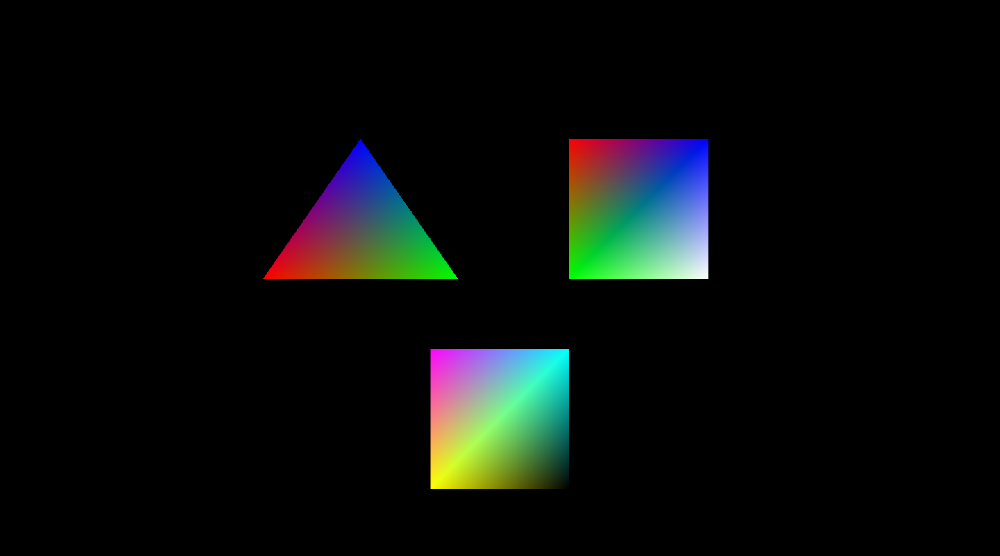
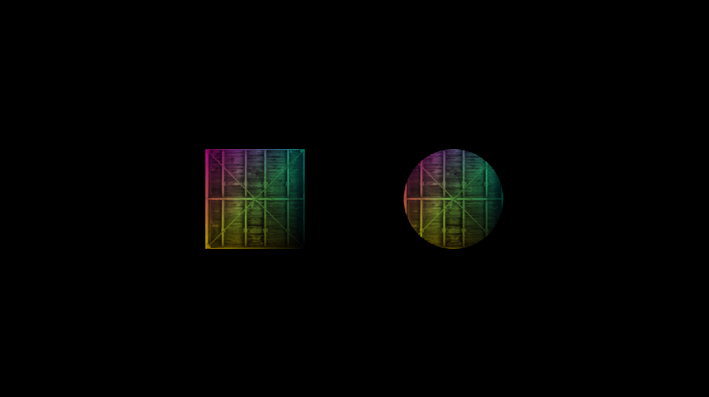
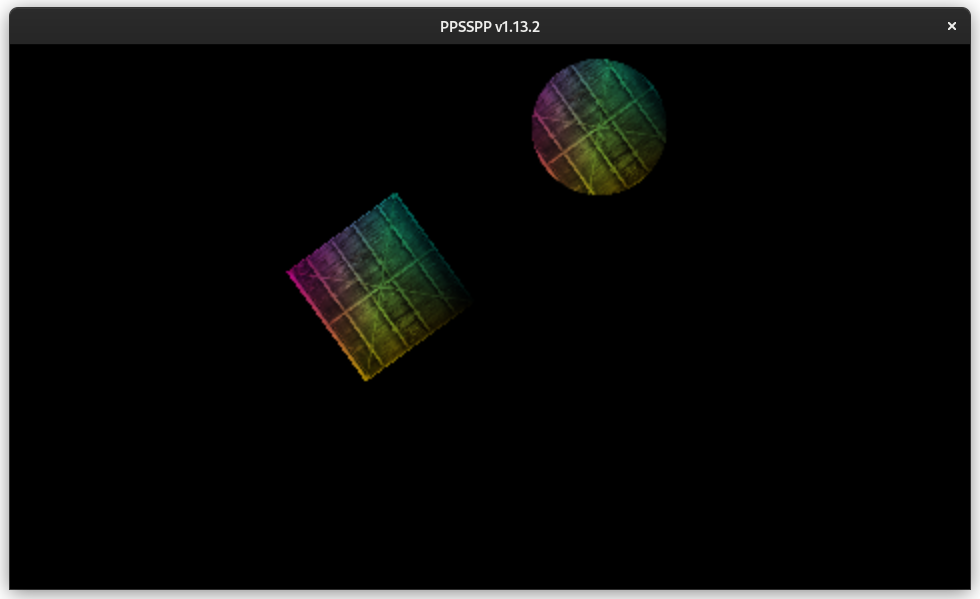
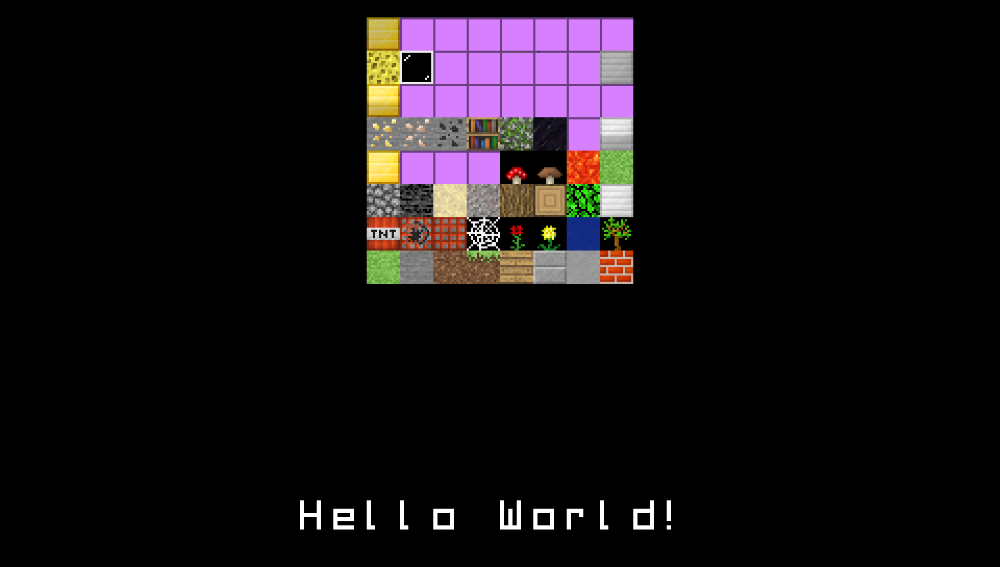

# PSP-GPU-Tutorials
The PSP Lacks a lot of GPU tutorials. Let's fix that. Also hosted on psp-dev.org

## Tutorial 1 - Context
- [Tutorial](https://psp-dev.org/doku.php?id=tutorial:context)
- [Source](https://github.com/IridescentRose/PSP-GPU-Tutorials/tree/master/1-Context)

## Tutorial 2 - Drawing / Indices

- [Tutorial](https://psp-dev.org/doku.php?id=tutorial:drawing)
- [Source](https://github.com/IridescentRose/PSP-GPU-Tutorials/tree/master/2-Drawing)

## Tutorial 3 - Drawing / Indices

- [Tutorial](https://psp-dev.org/doku.php?id=tutorial:texture)
- [Source](https://github.com/IridescentRose/PSP-GPU-Tutorials/tree/master/3-Textures)

## Tutorial 4 - Camera & Matrices

- [Tutorial](https://psp-dev.org/doku.php?id=tutorial:camera)
- [Source](https://github.com/IridescentRose/PSP-GPU-Tutorials/tree/master/4-Camera)

## Tutorial 5 - Mesh & Sprites

- [Tutorial](https://psp-dev.org/doku.php?id=tutorial:sprites)
- [Source](https://github.com/IridescentRose/PSP-GPU-Tutorials/tree/master/5-Sprites)

## Tutorial 6- Tilemaps

- [Tutorial](https://psp-dev.org/doku.php?id=tutorial:tilemaps)
- [Source](https://github.com/IridescentRose/PSP-GPU-Tutorials/tree/master/6-Tilemaps)